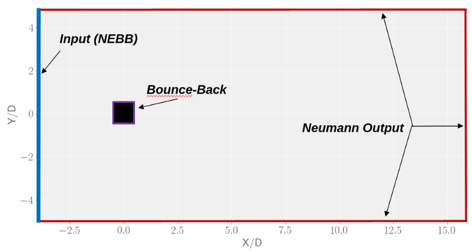
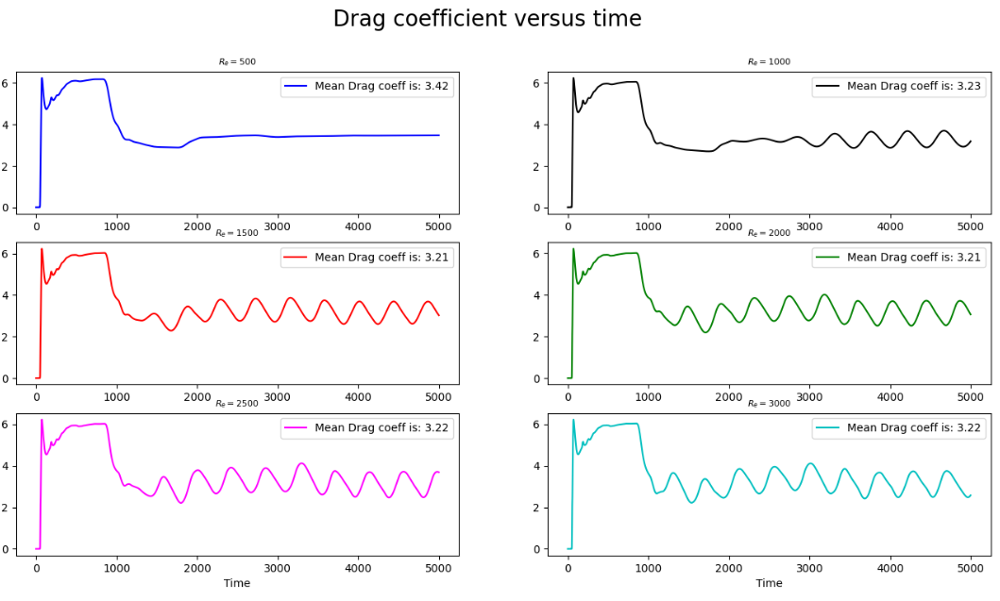
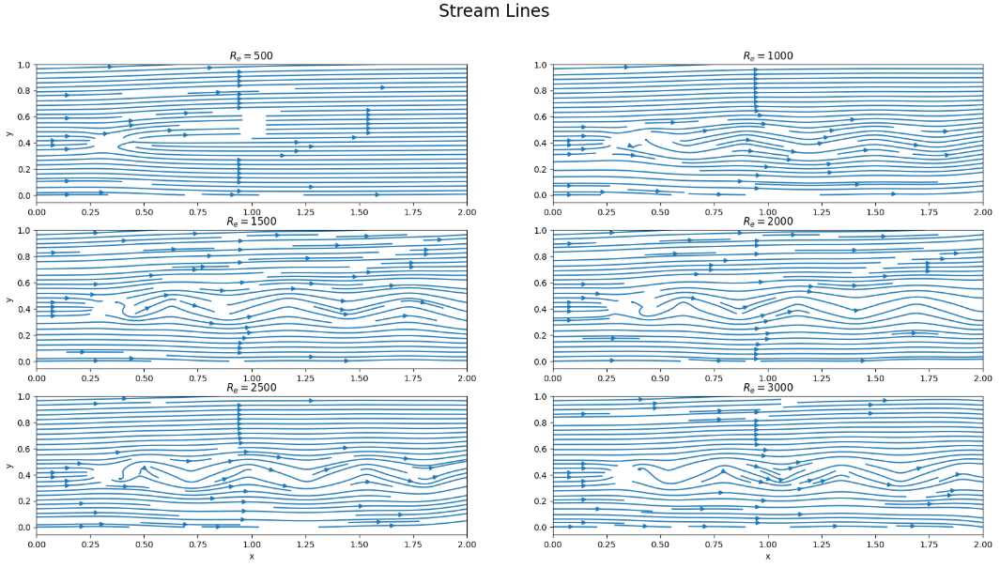
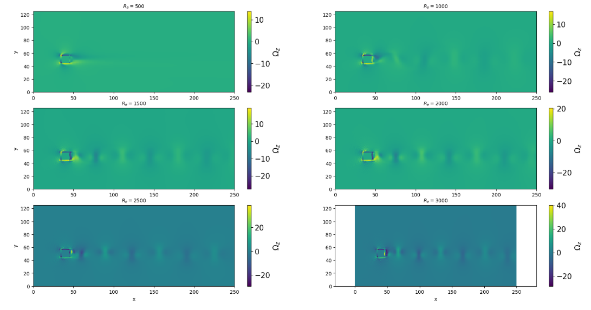
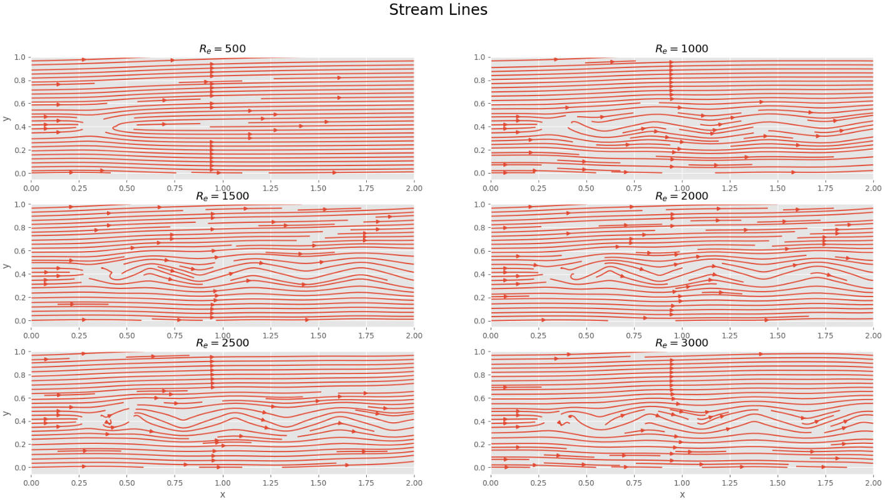
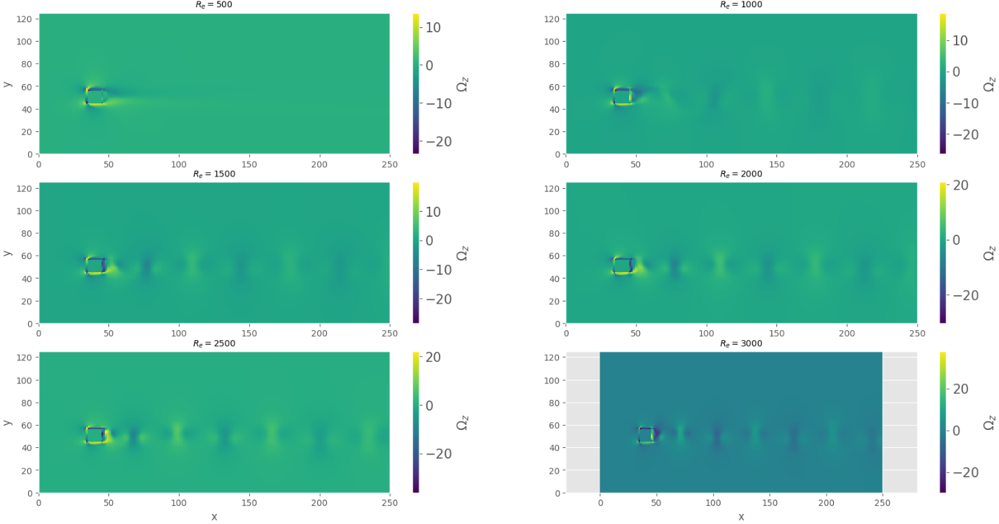

# Lattice Boltzmann Method

The Lattice Boltzmann Method (or LBM for short) is a numerical method dedicated to the simulation of fluids. 
This method became quite popular during the last decades for at least two reasons.

It is important to keep in mind that Vanilla CFD methods are usually quite challenging to fully grasp, as they are very complex and
computationally demanding. They implicitely rely on state-of-the-art numerical analysis and software engineering as it entails
to solve coupled kinetics and thermodynamics Partial Differential Equations (PDEs) in a given domain. Standard sophisticated numerical schemes with
this objective are Hybrid High Order (HHO) or Compatible Discrete Operator (CDO) schemes for example.

In this context, the LBM is advantageous by its simplicity. It is not computationally very expensive, easily parallelizable, and the resolution algorithm is quite simple, 
only a few steps. While most methods try to solve Navier-Stokes equations (recall this terminology also incorporates continuity and thermodynamics equations), the LBM focus on only one single equation, derived
from Statistical Physics: the **Boltzmann equation**. You might know that an infinite cascad of equations known as the BBGKY hierarchy arises from it by the moment methods.
In particular, the key point is that one can recover Navier-Stokes equations via the Chapman-Enskog development. The main hypothesis is that the dimensionless Knudsen number is very small, that is, 
the fluid is dense enough to be considered as a continuum medium.
Consequently, solving the Boltzmann equation guarantee you to encapsulate all the physics phenomenons described by Navier-Stokes equations, without
actually solving them directly! 

Hence, the LBM is dedicated to solve only one, yet very complicated, equation whose unknown is the distribution function, a multi-variate function of
2D+1 variables, where D is the space dimension. You can see the Wikipedia page for more information.

## Practical session N°1: Pulse of pressure 

The first term is dedicated to solve the transport equation with a pression pulse as initial condition. For this simple case, the analytical solution is known, that is perfect for benchmarking. In this simple set-up, you do not need to use high order methods involving viscosity or heat transfer, first order are enough. On the order, from left to right, you can find respectively the initial condition for the pulse of pressure, the numerical propagation of the latter, and finally the analytical solution.

     
## Practical session N°2: Moving cavity
This lab starts the real deal. Consider a box-like cavity, filled with a fluid, and move at uniform speed the top side.As a result, the whole fluid inside the box, by viscous effects, will start moving similarly to a vortex, around a center point. For the amount of code written, the result is quite convincing. At least for small Reynolds, you observe that ffor high Reynolds, the simulation does not yields relevant results anymore. This behaviour was expected, because the low order approximation is only valid for low Reynold number. The movement is however laminar for small Reynolds number, since the velocity lines are well defined and locally parallels.

     

## Practical session N°3:
In this lab, one tries to reproduce the [Kalman vortex street](https://en.wikipedia.org/wiki/K%C3%A1rm%C3%A1n_vortex_street), a very famous phenomenon in fluid dynamics. It is a repeating pattern of swirling vortices involving viscosity and requiring a Reynolds number above a certain threshold, typically around 90.

     

This last plot displays the vorticity, estimated by finite difference, for the different Reynolds number. The vorticity seems to outline the position of the vortices, like one could have expected.

## TP4:
A new collision method is studied. Indeed, taking into account collisions is necessary to model viscosity, but several methods are possibles. This lab explores two of them, only one actually work. You can see below the results are quite similar.

     
