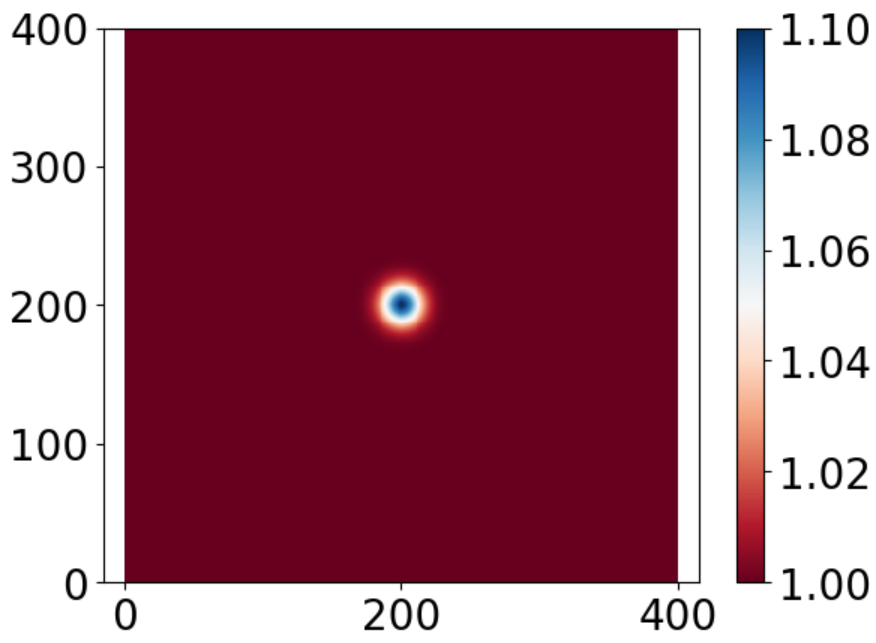
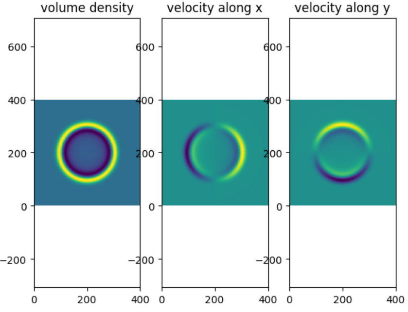
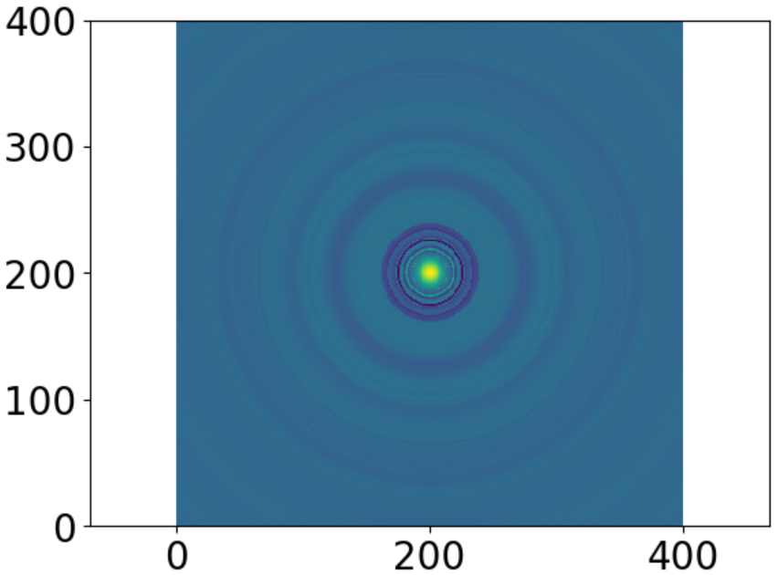
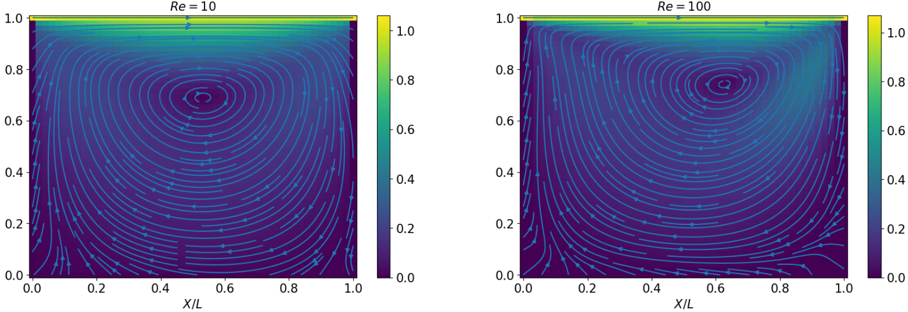
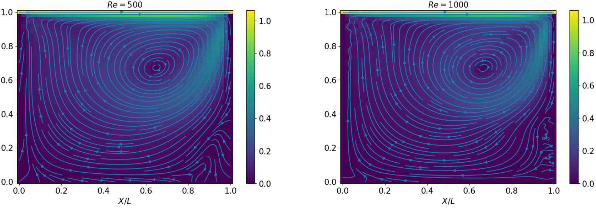
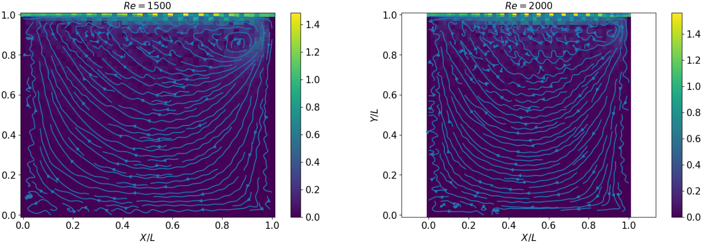

# Lattice Boltzmann Method

The Lattice Boltzmann Method (or LBM for short) is a numerical method dedicated to the simulation of fluids. 
This method became quite popular during the last decades for at least two reasons.

It is important to keep in mind that Vanilla CFD methods are usually quite challenging to fully grasp, as they are very complex and
computationally demanding. They implicitely rely on state-of-the-art numerical analysis and software engineering as it entails
to solve coupled kinetics and thermodynamics Partial Differential Equations (PDEs) in a given domain. Standard sophisticated numerical schemes with
this objective are Hybrid High Order (HHO) or Compatible Discrete Operator (CDO) schemes for example.

In this context, the LBM is advantageous by its simplicity. It is not computationally very expensive, easily parallelizable, and the resolution algorithm is quite simple, 
only a few steps. While most methods try to solve Navier-Stokes equations (recall this terminology also incorporates continuity and thermodynamics equations), the LBM focus on only one single equation, derived
from Statistical Physics: the **Boltzmann equation**. You might know that an infinite cascad of equations known as the BBGKY hierarchy arises from it by the moment methods.
In particular, the key point is that one can recover Navier-Stokes equations via the Chapman-Enskog development. The main hypothesis is that the dimensionless Knudsen number is very small, that is, 
the fluid is dense enough to be considered as a continuum medium.
Consequently, solving the Boltzmann equation guarantee you to encapsulate all the physics phenomenons described by Navier-Stokes equations, without
actually solving them directly! 

Hence, the LBM is dedicated to solve only one, yet very complicated, equation whose unknown is the distribution function, a multi-variate function of
2D+1 variables, where D is the space dimension. You can see the Wikipedia page for more information.

## TP1: Pulse of pressure 

The first term is dedicated to solve the transport equation with a pression pulse as initial condition. For this simple case, the analytical solution is known, that is perfect for benchmarking. In this simple set-up, you do not need to use high order methods involving viscosity or heat transfer, first order are enough. 

   

## TP2: Moving cavity
This labs starts the real deal. Consider a box-like cavity, filled with a fluid, and move at uniform speed the top side.As a result, the whole fluid inside the box, by viscous effects, will start moving similarly to a vortex, around a center point. For the amount of code written, the result is quite convincing.

     

## TP3:

## TP4:
